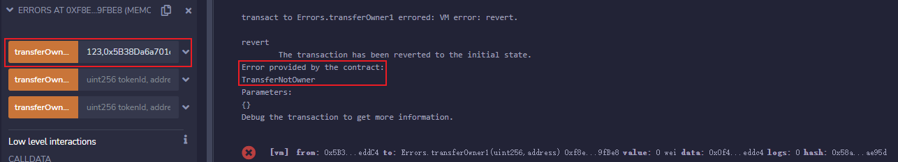
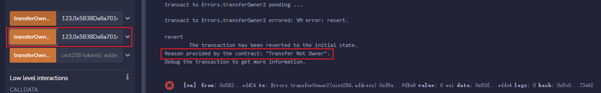
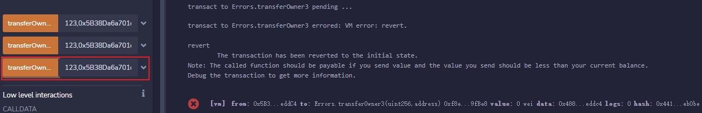

# Remix

1. 输入任意`uint256`数字和非 0 地址，调用`transferOwner1`，也就是`error`方法，控制台抛出了异常并显示我们自定义的`TransferNotOwner`。

   

2. 输入任意`uint256`数字和非 0 地址，调用`transferOwner2`，也就是`require`方法，控制台抛出了异常并打印出`require`中的字符串。

   

3. 输入任意`uint256`数字和非 0 地址，调用`transferOwner3`，也就是`assert`方法，控制台只抛出了异常。

   

## 三种方法的 gas 比较

我们比较一下三种抛出异常的`gas`消耗，通过 remix 控制台的 Debug 按钮，能查到每次函数调用的`gas`消耗分别如下：
（使用 0.8.17 版本编译）

1. **`error`方法`gas`消耗**：24457 (**加入参数后`gas`消耗**：24660)
2. **`require`方法`gas`消耗**：24755
3. **`assert`方法`gas`消耗**：24473

我们可以看到，`error`方法`gas`最少，其次是`assert`，`require`方法消耗`gas`最多！因此，`error`既可以告知用户抛出异常的原因，又能省`gas`，大家要多用！（注意，由于部署测试时间的不同，每个函数的`gas`消耗会有所不同，但是比较结果会是一致的。）

**备注:** Solidity 0.8.0 之前的版本，`assert`抛出的是一个 `panic exception`，会把剩余的 `gas` 全部消耗，不会返还。更多细节见[官方文档](https://docs.soliditylang.org/en/v0.8.17/control-structures.html)。
