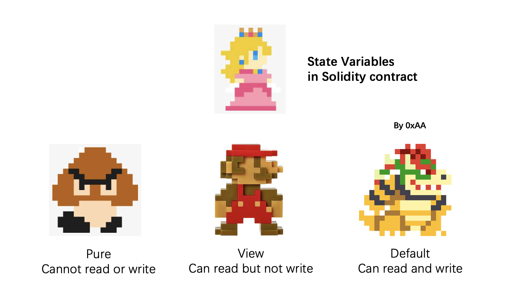

# Solidity: Function

## Function

Here's the format of a function in Solidity:

```solidity
    function <function name>(<parameter types>) [internal|external] [pure|view|payable] [returns (<return types>)]
```

It may seem complex, but let's break it down piece by piece (square brackets indicate optional keywords):

- `function`: This is the keyword that indicates that we are defining a function.
- `<function name>`: This is the name of the function. It should be descriptive and expressive.
- `(<parameter types>)`: This is the list of parameters that the function takes. If the function doesn't take any parameters, you can omit this part.
- `[internal|external|public|private]`: Function visibility specifiers. There are 4 kinds of them public is the default visibility if left empty:

  - `public`: Visible to all.
  - `private`: Can only be accessed within this contract, derived contracts cannot use it.
  - `external`: Can only be called from other contracts. But can also be called by `this.f()` inside the contract, where `f`is the function name.
  - `internal`: Can only be accessed internal and by contracts deriving from it.

  - **Note 1**: `public` is the default visibility for functions.
  - **Note 2**: `public|private|internal` can be also used on state variables. Public variables will automatically generate `getter` functions for querying values.
  - **Note 3**: The default visibility for state variables is `internal`.

- `[pure|view|payable]`: This is the state mutability of the function. `pure` functions don't modify the state, `view` functions don't modify the state but can read from the state, and `payable` functions can receive Ether.
- `[returns (<return types>)]`: This is the list of return types that the function returns. If the function doesn't return anything, you can omit this part.

## `Pure` and `View` ?

When I started learning `solidity`, I didn't understand `pure` and `view` at all, since they are not common in other languages. `solidity` added these two keywords, because of `gas fee`. The contract state variables are stored on block chain, and `gas fee` is very expensive. If you don't rewrite these variables, you don't need to pay `gas`. You don't need to pay `gas` for calling `pure` and `view` functions.

The following statements are considered modifying the state:

1. Writing to state variables.
2. Emitting events.
3. Creating other contracts.
4. Using selfdestruct.
5. Sending Ether via calls.
6. Calling any function not marked view or pure.
7. Using low-level calls.
8. Using inline assembly that contains certain opcodes.

I drew a Mario cartton to visualize `pure` and `view`. In the picture, the state variable is represented by Princess Peach, keywards are represented by three different characters.

